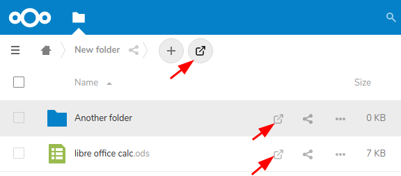

# Open webdav folder or file in associated app

Place this app in **nextcloud/apps/** and enable



## Windows 7+

### BAT file (e.g. C:/explorer.bat)

```
@echo off
set str=%1%
net use \\<YOUR_SERVER_URL>@SSL\DavWWWRoot\remote.php\webdav
call powerShell.exe -ExecutionPolicy RemoteSigned -Command "&{[Reflection.Assembly]::LoadWithPartialName('System.Web')|Out-Null; $url = ($env:str -replace '[/]', '\') -replace 'openwebdav:', ''; start explorer.exe -ArgumentList ([System.Web.HttpUtility]::UrlDecode($url));}"
```

### REG file

```
Windows Registry Editor Version 5.00

[HKEY_CLASSES_ROOT\openwebdav]
@="URL:openwebdav Protocol"
"URL Protocol"=""
[HKEY_CLASSES_ROOT\openwebdav\shell]
[HKEY_CLASSES_ROOT\openwebdav\shell\open]
[HKEY_CLASSES_ROOT\openwebdav\shell\open\command]
@="\"C:\\explorer.bat\" \"%1\""
```

### Fix windows webdav client error 405 - .htaccess

```
  RewriteEngine on

  RewriteCond %{REQUEST_URI} ^(/)$ [NC]
  RewriteCond %{REQUEST_METHOD} ^(OPTIONS|PROPFIND)$
  RewriteRule .* https://%{HTTP_HOST}/remote.php/webdav/ [R=301,L]
```

## Linux

TODO

In Chrome works instantly on my config (ubuntu 18.04 with budgie desktop)

## MacOS

TODO

## Description

Tested only in Chrome on Windows 7, Windows Server 2019 and Ubuntu 18.04


Icon from https://www.iconfinder.com/iconsets/feather
